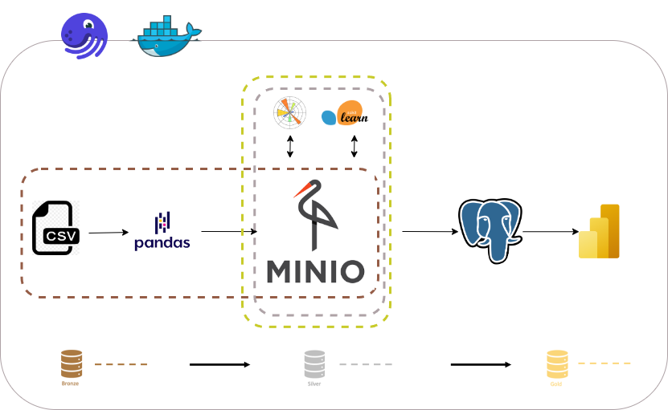
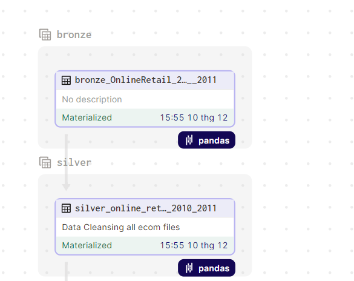
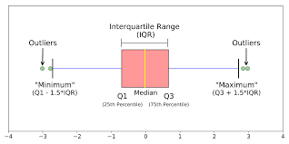
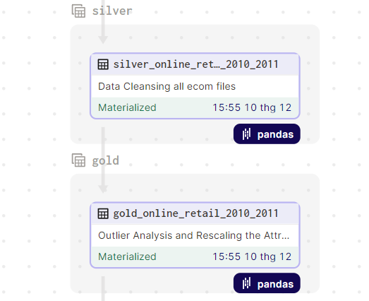
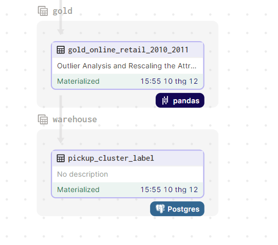
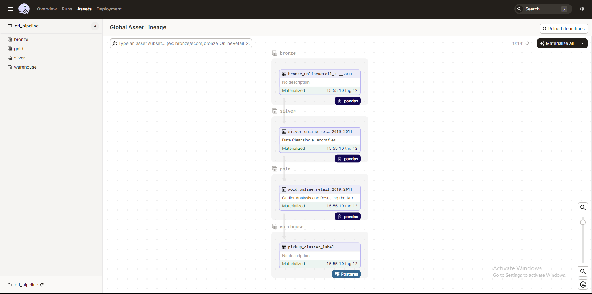
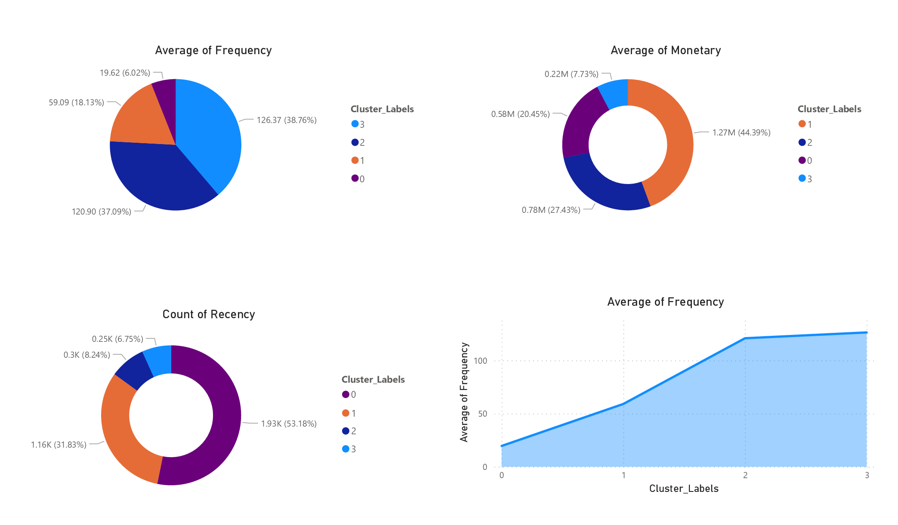

## Precision Marketing Analytics

<div style="text-align:center"></div>

## I. Introduce
    
### 1. Overview
       Implement a hierarchical cluster algorithm to cluster target customers and evaluate based on RFM Segmentation
### 2. The goal of this project
The purpose of this paper was to demonstrate the process of implementing ETL (Extract, Transform, Load) on non-store online retail occurring between 01/12/2010 and 09/12/2011 for a UK-based. The report's objectives are as follows:
- Online retail data source is presented in detail
- Explain the ETL procedure used to extract, transform, and load data into the system:
    - Apply Hierarchical Clustering algorithm during data processing and transportation
- Displays findings and processed data before applying the Hierarchical Clustering algorithm for later analysis and reporting.
  - Use RFM Segmentation to evaluate and analyze data based on clusters gathered through the Hierarchical Clustering algorithm:
  - Customer buying behavior is based on three factors:
      - Recency (the most recent time of purchase)
      - Frequency (how often)
      - Monetary (the monetary value of each purchase)
### 3. Data sources
This is a transnational data set which contains all the transactions occurring between 01/12/2010 and 09/12/2011 for a UK-based and registered non-store online retail.

The dataset used
  - 2 months (October - November / 2023)
  - Online Retail - https://archive.ics.uci.edu/static/public/352/online+retail.zip
> **Online Retail Record Data:**
> 
> Link website: https://archive.ics.uci.edu/dataset/352/online+retail
> 
> Data Dictionary: 
>     https://api.semanticscholar.org/CorpusID:7525166
>     https://api.semanticscholar.org/CorpusID:3673926

## II. Architecture
<div style="text-align:center"></div>.

#### 1. Containerize the application with `Docker` and orchestrate assets with `Dagster`.
#### 2. Bronze layer
   - Online Retail Data is obtained in `.csv` format from **Online Retail Record Data** before being read by `Pandas` and loaded into the `MinIO`.
  ```Python
    def create_dataset(address, name_asset):

    @asset(
        name=name_asset,
        io_manager_key="minio_io_manager",
        key_prefix=[LAYER, SCHEMA],
        compute_kind=COMPUTE_KIND,
        group_name=LAYER,
    )
    def bronze_dataset(context) -> Output[pd.DataFrame]:
        df = pd.read_csv(address, encoding='unicode_escape')
        return Output(
            df,
            metadata={
                "directory": address,
                "table": name_asset,
                "records count": len(df),
            }
        )
    return bronze_dataset
  ```
  - Data is downloaded and stored in localhost computer and used library `os` to read
  ```Python
  address = os.path.join(Path(__file__).parents[2], 'E-Commerce Retail/OnlineRetail_2010__2011.csv')
  name_asset = "bronze_OnlineRetail_2010__2011"
  silver_e_commerce_retail_2010_2011 = create_dataset(address, name_asset)
  ```

#### 3. Silver layer
  - Load data from MinIO into `Pandas` to Cleaning and Update Column in order to create data modeling.
  - Data Cleansing processes will be conducted then corresponding new columns such as Recency, Frequency, Monetary will be created based on the formula:
  
  > M(Monetary): Tổng số tiền giao dịch (doanh số đóng góp):
  >   - Monetary = Quantity * UnitPrice
  > ```Python
  >  retail['Monetary'] = retail['Quantity'] * retail['UnitPrice']
  >  rt_m = retail.groupby('CustomerID')['Monetary'].sum()
  >  rt_m = rt_m.reset_index()
  > ```

  

  > R(Recency): Khoảng thời gian từ lần giao dịch gần nhất đến hiện tại
  > - Tính ngày giao dịch của lần giao dịch cuối cùng
  > - Recency = Min( Ngày giao dịch của lần giao dịch cuối cùng - Ngày giao dịch của từng khách hàng )
  > ```Python
  > # Tính ngày giao dịch của lần giao dịch cuối cùng
  > max_date = max(retail['InvoiceDate'])
  > 
  > retail['Recency'] = max_date - retail['InvoiceDate']
  > rt_r = retail.groupby('CustomerID')['Recency'].min()
  > rt_r = rt_r.reset_index()
  > 
  > # Định dạng ngày cho cột Recency 
  > # i.e: 325 days 02:33:00 --> 325 
  > rt_r['Recency'] = rt_r['Recency'].dt.days
  > ```  


  > F(Frequency): Tổng số lần giao dịch
  > - Frequency = Tổng số hóa đơn của từng khách hàng
  > ```Python
  > rt_f = retail.groupby('CustomerID')['InvoiceNo'].count()
  > rt_f = rt_f.reset_index()
  > rt_f.columns = ['CustomerID', 'Frequency']
  > ```

- Convert the `Pandas` DataFrame to `.csv` and then import it into `MinIO`.


<div style="text-align:center"></div>.


#### 4. Gold layer
  - Load data from MinIO into `Pandas` to convert the raw to gold.
    - Outlier Analysis:
      > - Outliers are values within a dataset that vary greatly from the others. They’re either much larger, or significantly smaller.
      <div style="text-align:center"></div>.
      
      
      > - There are 2 types of outliers and we will treat outliers as it can skew our dataset:
      >     - `Statistical`
      >     - `Domain specific`
        > #### Outlier Analysis of Monetary, Frequency and Recency
      > ```Python
      >  def find_outliers_IQR(df, tag):
      >  # Tạo hàm xóa outliers sử dụng IQR
      >  Q1 = df[tag].quantile(0.25)
      >
      >  Q3 = df[tag].quantile(0.75)
      >
      >  IQR = Q3 - Q1
      >
      >  outliers = df[(df[tag] >= Q1 - 1.5 * IQR) & (df[tag] <= Q3 + 1.5 * IQR)]
      >
      >  return outliers
      > ```
        > #### Removing (statistical) outliers for Monetary, Recency and Frequency
        > ```Python
        > def remove_outlier(df):
        >   df = find_outliers_IQR(df, "Monetary")
        >   df = find_outliers_IQR(df, "Recency")
        >   df = find_outliers_IQR(df, "Frequency")
        >   return df
        > ```
    - Rescaling the Attributes
      > - It is extremely important to rescale the variables so that they have a comparable scale.| There are two common ways of rescaling:
      >     - Min-Max scaling
      >     - Standardisation (mean-0, sigma-1)
      > ```Python
      >  def rescaling(df):
      >      rfm_df = df[['Monetary', 'Frequency', 'Recency']]
      > 
      >      # Instantiate
      >      scaler = StandardScaler()
      > 
      >      # fit_transform
      >      rfm_df_scaled = scaler.fit_transform(rfm_df)
      > 
      >      return rfm_df_scaled
      >```
    - Steps to apply Hierachical Clustering algorithm:
        > Receive new data after Rescaling. Use library `scipy` to draw tree dendrogram through linkage function with parameters:
        > - y=rfm_df_scaled
        > - method="complete"
        > - metric="euclidean"
        > ```Python
        > def HierachicalClustering(df):
        >       mergings = linkage(df, method="complete", metric='euclidean')
        >       return mergings
        > ```
        > Then use the cut_tree function of library `scipy` to determine the desired clusters with parameters:
        >   - Z=mergings ( Function output HierachicalClustering() )
        >   - n_clusters=4 (The number of clusters is predetermined)
        > ```Python
        > def cut_tree_dendrogram(mergings, df):
        >       cluster_labels = cut_tree(mergings,  n_clusters=[4]).reshape(-1, )
        >       # reshape(-1, ) is used to convert matrix to 1 dimensional array
        >       df['Cluster_Labels'] = cluster_labels
        >       return df
        > ```
  - Convert the `Pandas` DataFrame to `.parquet` and then import it into `MinIO`.


<div style="text-align:center"></div>.

    
#### 5. Using `Postgres` transform as necessary.
<div style="text-align:center"></div>.

#### 6. Utilize `Power BI` to visualize the data.

## III. Data Lineage


## IV. Visualization 

